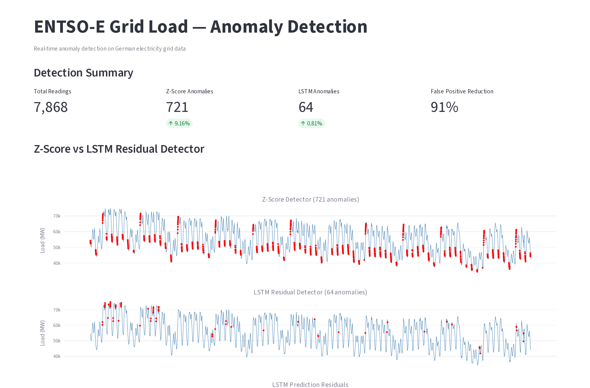
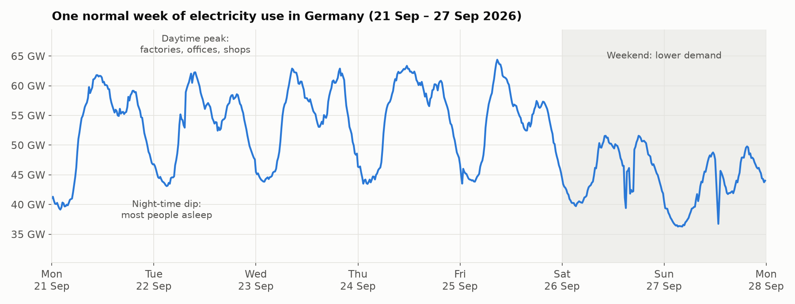
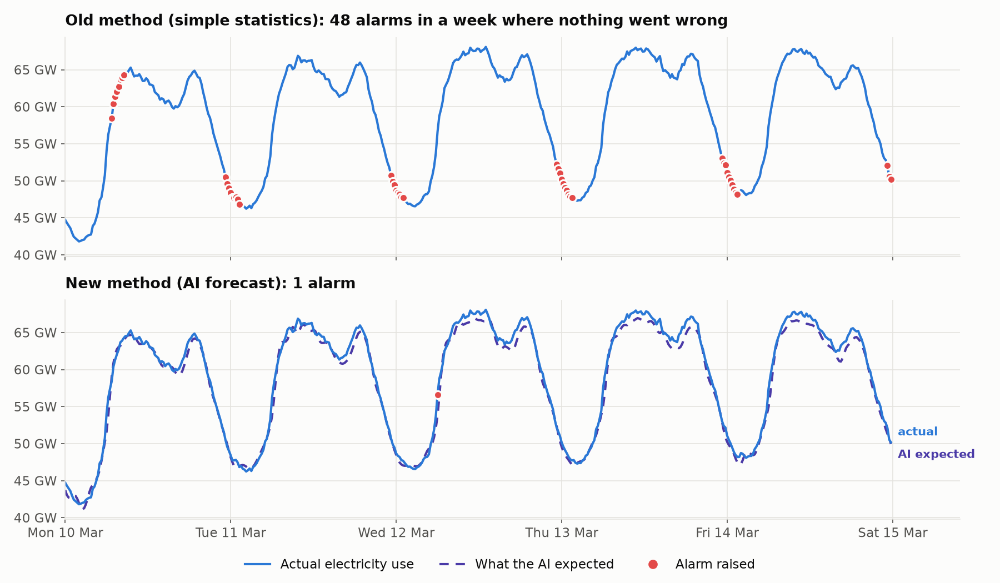
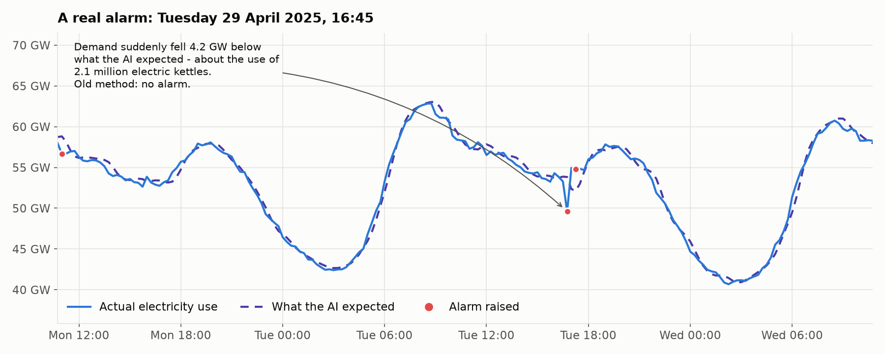
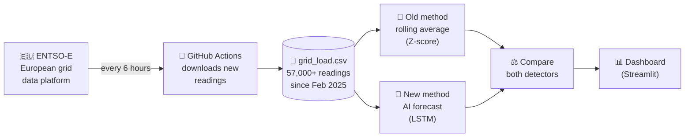
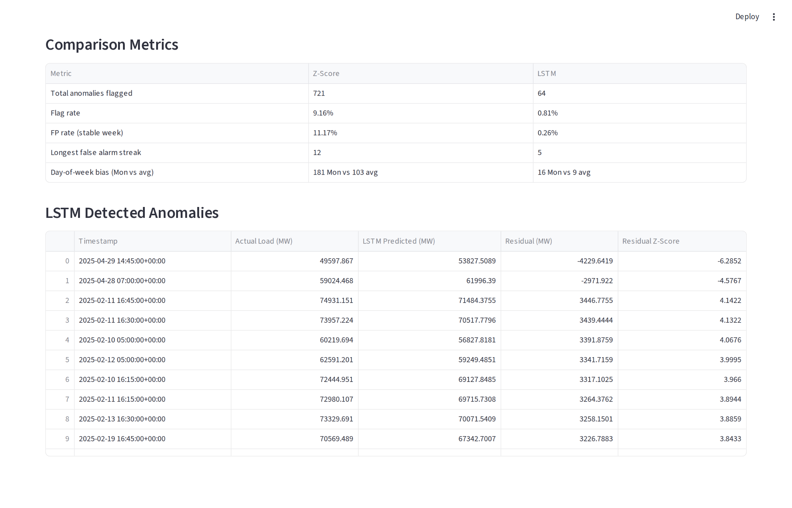

# ⚡ Grid Anomaly Detector

**An early-warning system for Germany's electricity grid.** It collects official electricity-demand data every few hours and uses AI to spot moments when the grid behaves unexpectedly, without raising dozens of false alarms every day.

[](https://github.com/SubhanSaadatKhan/grid-anomaly-detector/actions/workflows/fetch_data.yml)
[](https://github.com/SubhanSaadatKhan/grid-anomaly-detector/actions/workflows/tests.yml)



---

## 🧭 The idea in 60 seconds (no tech background needed)

**Electricity has to be produced at the exact moment it is used.** Grid operators watch demand around the clock, because a sudden unexpected jump or drop can mean trouble: a power plant tripping offline, a data error, or a surge of solar power swamping the network. In April 2026 German electricity prices even went *negative* (−€200/MWh) because renewables produced more than anyone needed.

Spotting "unusual" is harder than it sounds, because **electricity demand is never flat.** It follows a rhythm:



*Every weekday climbs in the morning as factories, offices and shops switch on, and falls at night. Weekends are noticeably quieter. All of this is completely normal.*

### The problem: a naive alarm cries wolf

The simplest approach is a rule like *"raise an alarm if demand is far from its recent average"*. That rule doesn't understand the daily rhythm, so it panics every evening when demand drops and every Monday morning when it jumps. The top chart below shows an ordinary week in March 2025 where nothing went wrong. The simple rule still raised **48 alarms**.



### The solution: an AI that knows what "normal" looks like

Instead of a fixed rule, this project trains an AI model (an **LSTM**, a type of neural network that is good at learning patterns over time). The model looks at the **last 7 days** of demand, together with the time of day and the day of the week, and predicts what demand should be **15 minutes from now** (dashed line). An alarm is raised only when reality differs sharply from that prediction.

On the same normal week the AI raised **1 alarm** instead of 48. It still catches genuine surprises:



### Results at a glance

Tested on 7,868 readings (Feb–Apr 2025, one reading every 15 minutes):

| | Old method (simple statistics) | New method (AI forecast) |
|---|---|---|
| Share of readings flagged | 9.16% (roughly 1 in 11) | **0.81%** (roughly 1 in 120) |
| False alarms in a known-calm week | 11.17% | **0.26%** |
| Longest run of back-to-back alarms | 12 (3 hours) | **5** |
| Extra alarms on Mondays vs. average day | 181 vs 103 | 16 vs 9 |
| **Alarms removed** | | **91% fewer** |

The AI's predictions are typically within **about 1.1%** of the real value.

---

## 🔄 How it works



1. **Collect.** A GitHub Actions robot wakes up every 6 hours, asks [ENTSO-E](https://transparency.entsoe.eu/) (the official transparency platform of Europe's grid operators) for Germany's latest electricity demand, and saves it to `data/grid_load.csv`. It has been running since June 2026 and the file now holds 57,000+ readings.
2. **Detect (old way).** A rolling Z-score measures how far each reading is from the average of the previous 18 hours.
3. **Detect (new way).** An LSTM neural network predicts each reading from the week before it. Big prediction errors (over 3 standard deviations) become alarms.
4. **Compare and display.** Both detectors are scored side by side, and the results are shown on an interactive dashboard.



---

## 🗂️ What's in this repository

| File | What it does |
|---|---|
| `.github/workflows/fetch_data.yml` | The robot: runs `update_data.py` every 6 hours and commits new data |
| `.github/workflows/tests.yml` | Runs the automated tests on every code change |
| `data/fetch_data.py` | One-off script that downloaded the original Feb–Apr 2025 data |
| `data/update_data.py` | Appends the newest readings; copes with ENTSO-E outages (see below) |
| `data/grid_load.csv` | The dataset: timestamp (UTC) + electricity demand in megawatts |
| `detector/detect.py` | Old method: rolling Z-score on the whole dataset, plus a plot |
| `detector/stream.py` | Replays the data reading by reading, as if live, and stores Z-score results in `anomalies.db` |
| `detector/evaluate_baseline.py` | Diagnoses *why* the Z-score fails (weekday bias, time-of-day clustering, streaks) |
| `detector/lstm_model.py` | The AI model definition (2-layer LSTM, 64 units) |
| `detector/train_lstm.py` | Trains the LSTM and saves `lstm_best.pt` + `scaler.pkl` |
| `detector/compare.py` | Runs both detectors and writes `comparison_results.csv` + `comparison_plot.png` |
| `dashboard/app.py` | The interactive Streamlit dashboard |
| `docs/make_readme_figures.py` | Regenerates the pictures in this README |
| `tests/` | Tests for the data updater (simulates ENTSO-E outages; no API key needed) |

---

## 🚀 Run it yourself

```bash
git clone https://github.com/SubhanSaadatKhan/grid-anomaly-detector.git
cd grid-anomaly-detector
pip install -r requirements.txt

# See the dashboard (uses the results already in the repo)
streamlit run dashboard/app.py
```

To rebuild everything from scratch, run the scripts from the repo root in this order:

```bash
python detector/stream.py            # Z-score baseline -> data/anomalies.db
python detector/evaluate_baseline.py # why the baseline fails
python detector/train_lstm.py        # train the AI (GPU optional)
python detector/compare.py           # compare both -> data/comparison_results.csv
python docs/make_readme_figures.py   # refresh README images
```

To download fresh data you need a free ENTSO-E API key. Register at [transparency.entsoe.eu](https://transparency.entsoe.eu/), then email transparency@entsoe.eu asking for "Restful API access". The key then appears under *My Account Settings*. On GitHub, store it as the `ENTSOE_API_KEY` repository secret.

```bash
export ENTSOE_API_KEY=your-key
python data/update_data.py
```

Run the tests with `pip install pytest && pytest tests`.

---

## 🛠️ Why the GitHub Actions runs used to fail, and how it was fixed

About 1 in 18 scheduled runs (25 of 445) failed, sometimes 10 in a row. Every failure came from the ENTSO-E API, not from this code's logic:

| Error seen in logs | What it means |
|---|---|
| `503 Service Unavailable` | ENTSO-E servers down or under maintenance |
| `404 Not Found` / `599` | Temporary gateway errors on ENTSO-E's side |
| `NoMatchingDataError` | ENTSO-E hadn't published the newest hours yet |

The old `update_data.py` made one big request and crashed on any of these. Each crash also left the next request larger, and the outages left permanent holes in the data (up to 14 hours). The updater now:

- **fetches one day at a time and retries** temporary errors with increasing waits,
- **treats "no new data yet" and outages as warnings**, so the run stays green and the next run catches up,
- **re-checks the last 3 days every run**, so late-published hours fill the gaps. You can backfill further by clicking *Run workflow* and setting `backfill_days`,
- **fails loudly only when a human must act**: a missing or rejected API key, or no new data for over 7 days,
- **stores every timestamp in UTC**, instead of a mix of `+00:00` and `+02:00`.

The workflow also moved to Node 24–based actions (removing deprecation warnings), stops two runs from writing at once, and rebases before pushing so it never loses a race with another commit.

---

## 📚 Technical notes

- **Data:** ENTSO-E "Actual Total Load" for the DE-LU bidding zone at 15-minute resolution.
- **Baseline:** rolling Z-score, window = 72 readings (18 h), threshold = 2.5σ. On the Feb–Apr 2025 data it flags 9.1% of 8,468 readings. Alarms cluster at 21:00–00:00 and 05:00–07:00 UTC (the daily ramps), Monday gets 4.5× more alarms than Sunday, and there are 87 streaks longer than 3 readings. In short, it cannot tell a daily or weekly pattern from an anomaly.
- **LSTM:** input = 672 steps (7 days) × 3 features (scaled load, hour of day, day of week); 2 layers × 64 hidden units, dropout 0.2; AdamW + cosine LR schedule, early stopping on a chronological 80/20 split. Anomaly = |residual z-score| > 3.
- **Current limitations:** the model and dashboard cover the original Feb–Apr 2025 period. New data is collected automatically, but the model isn't retrained or re-scored on it yet. The scaler is fit on the full series, and the anomaly threshold is computed in-sample.
